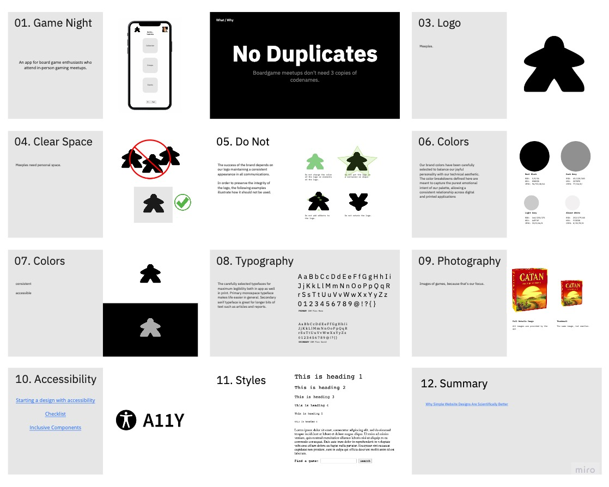

# Game Night

 
_an app for boardgame enthusiasts who attend in-person gaming meetups._

Hosting and attending in-person board gaming meetups has specific challenges that are difficult to meet with generic tools. The app will focus on those challenges, such as easily viewing detailed information about the games members plan to bring to an event.

## Technology

_PostgreSQL Express React Node.js_

- Auth0
- Board Game Atlas api
- Sass

## MVP

- User can

  - log in to their account
  - search for games
  - add board games to their collection
  - browse their collection/ filter
  - delete games from their collection
  - log out

- User can

  - join or create a group
  - search groups
  - edit details about their group
  - view a list of their groups
  - view an individual group's page
  - delete a group they own or leave a group

- User can
  - create or join a group's event
  - search events
  - edit details about an event they own
  - add games to the event from their collection
  - remove games from the event
  - delete an event

## Nice-to-Have Features

- Chat/forum in groups
- Chat/forum in events
- Private and public groups
- Invite to group

## Technical Risks

_What could go wrong?_

- Auth0 presents a challenge
  - Utilize mentorship to make it work
- Complicated permissions wrt joining groups and viewing other user data
  - Work on MVP first

## Design

### User Flow

#### Login Flow

#### User has Logged in

[](https://mermaid-js.github.io/mermaid-live-editor/edit/#eyJjb2RlIjoiZ3JhcGggVERcbiAgICBBW0hvbWVdIC0tPnxWaWV3LyBBZGQvIERlbGV0ZSBHYW1lc3wgQihHYW1lcylcbiAgICBCIC0tPiBDe1RodW1ibmFpbHMgb2YgdGhlaXIgY29sbGVjdGlvbiB3aXRoIEFkZCBhbmQgRGVsZXRlIG9wdGlvbnN9XG4gICAgQyAtLT58QWRkfCBEW1NlYXJjaF1cbiAgICBDIC0tPnxWaWV3IERldGFpbHwgRVtWaWV3IERldGFpbCBQYWdlIG9mIFNwZWNpZmljIEdhbWVdXG4gICAgQyAtLT58RGVsZXRlIEdhbWV8IEZbRGVsZXRlIEdhbWUgZnJvbSBDb2xsZWN0aW9uXVxuICAiLCJtZXJtYWlkIjoie1xuICBcInRoZW1lXCI6IFwiZGVmYXVsdFwiXG59IiwidXBkYXRlRWRpdG9yIjp0cnVlLCJhdXRvU3luYyI6dHJ1ZSwidXBkYXRlRGlhZ3JhbSI6dHJ1ZX0)

### Wireframing

### Style Guide

- [miro style guide](https://miro.com/app/board/o9J_lqw9zwA=/?invite_link_id=569067279198)
  
