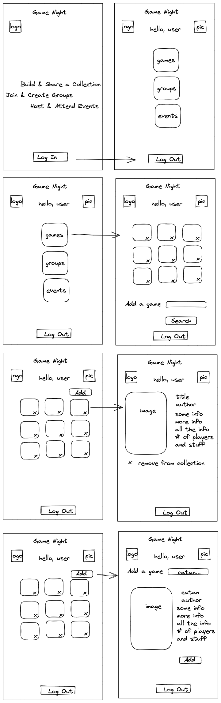

# Game Night

 
_An app for boardgame enthusiasts who attend in-person gaming meetups_

Hosting and attending in-person board gaming meetups has specific challenges that are difficult to meet with generic tools. The app will focus on meeting those challenges, such as easily viewing detailed information about the games members plan to bring to an event.

## Technology

_PostgreSQL Express React Node.js_

- Auth0
- Board Game Atlas api
- Sass

## MVP

- User can

  - log in to their account
  - search for games
  - add board games to their collection
  - browse their collection/ filter
  - delete games from their collection
  - log out

- User can
  - create an event / join an event
  - add people to the event
  - filter their events
  - edit details about an event they own
  - add games to the event from their collection
  - remove games from the event
  - delete an event

## Nice-to-Have Features

- Chat/forum in events
- Copy an event/ recur

## Technical Risks

_What could go wrong?_

- Auth0 presents a challenge
  - Utilize mentorship to make it work
- Complicated permissions wrt joining events and viewing other user data
  - Work on MVP first

## Design

### User Flow

#### User has Logged in

[](https://mermaid-js.github.io/mermaid-live-editor/edit/#eyJjb2RlIjoiZ3JhcGggVERcbiAgICBBW0hvbWVdIC0tPnxWaWV3LyBBZGQvIERlbGV0ZSBHYW1lc3wgQihHYW1lcylcbiAgICBCIC0tPiBDe1RodW1ibmFpbHMgb2YgdGhlaXIgY29sbGVjdGlvbiB3aXRoIEFkZCBhbmQgRGVsZXRlIG9wdGlvbnN9XG4gICAgQyAtLT58QWRkfCBEW1NlYXJjaF1cbiAgICBDIC0tPnxWaWV3IERldGFpbHwgRVtWaWV3IERldGFpbCBQYWdlIG9mIFNwZWNpZmljIEdhbWVdXG4gICAgQyAtLT58RGVsZXRlIEdhbWV8IEZbRGVsZXRlIEdhbWUgZnJvbSBDb2xsZWN0aW9uXVxuICAiLCJtZXJtYWlkIjoie1xuICBcInRoZW1lXCI6IFwiZGVmYXVsdFwiXG59IiwidXBkYXRlRWRpdG9yIjp0cnVlLCJhdXRvU3luYyI6dHJ1ZSwidXBkYXRlRGlhZ3JhbSI6dHJ1ZX0)

### Wireframing

### Style Guide

- [miro style guide](https://miro.com/app/board/o9J_lqw9zwA=/?invite_link_id=569067279198)
